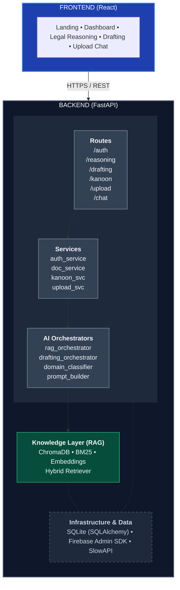
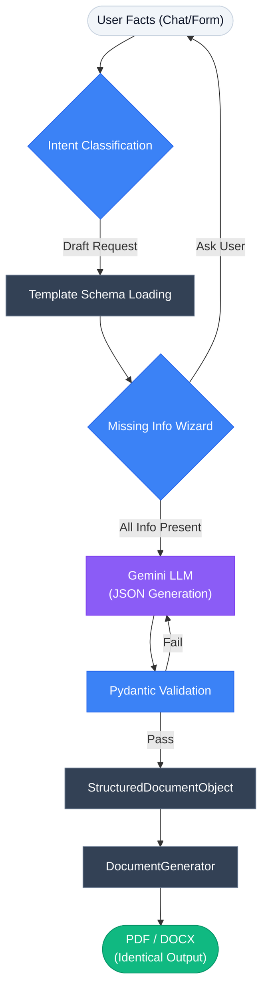

# NYAAY AI — Indian Legal AI Workspace

<div align="center">


**An AI-powered legal workspace designed for the Indian legal ecosystem.**
Legal Reasoning · Document Drafting · Document Analysis · Know Your Kanoon

</div>

---

NYAAY AI is a full-stack, AI-powered legal assistant designed for the Indian legal context. It uses the Gemini API and a custom Retrieval-Augmented Generation (RAG) pipeline to support legal reasoning, legal document drafting, and analysis of uploaded PDFs/DOCX files against Indian legal corpora.

**Status:** Portfolio Ready (v1.0)

---

## Key Features

* **Deterministic Metadata-Aware Legal Engine:** Queries a custom RAG pipeline built on Indian legal corpora using a hybrid approach (BM25 + Embeddings) enhanced with deterministic metadata-filtering (Domain Classification & Document Type tagging) to strictly eliminate hallucination and context leakage.
* **Document Drafting:** Generates structured legal drafts such as notices, agreements, complaints, and applications — with a deterministic PDF/DOCX pipeline that prevents LLM hallucination of formatting.
* **Document Upload and Chat:** Allows users to upload PDFs/DOCX files and ask questions, extract insights, or summarize complex documents.
* **Know Your Kanoon:** Answers Indian legal queries with citations sourced from the RAG knowledge base.
* **Authentication and History:** Uses Firebase authentication with persistent chat/document records stored through the backend.
* **Counter Arguments:** Generates counter-argument analysis for legal positions.

---

## Architecture

NYAAY AI follows a clean separation between the AI/RAG layer and the web API layer.



### Drafting Pipeline (Deterministic)



> **Architectural guarantee:** Formatting is deterministic and code-controlled. The LLM never generates formatting — only legally accurate content. See [`DOCS/ARCHITECTURE.md`](DOCS/ARCHITECTURE.md) for the full specification.

---

## Technology Stack

### Backend

* **Framework:** FastAPI
* **AI and LLM:** Google Gemini API (`google-genai`) with a custom RAG pipeline
* **Vector Store:** ChromaDB with hybrid BM25 + embedding retrieval
* **Database:** SQLite with SQLAlchemy
* **Authentication:** Firebase Admin SDK (server-side token verification)
* **Document Processing:** PyMuPDF and python-docx
* **Rate Limiting:** SlowAPI

### Frontend

* **Framework:** React 18 with Vite
* **Styling:** Tailwind CSS
* **Authentication:** Firebase Auth (client-side)
* **API Client:** Axios
* **Routing:** React Router v6

### Deployment and DevOps

* Docker and Docker Compose
* Nginx for frontend serving and reverse proxy
* GitHub Actions workflow (`.github/workflows/deploy.yml`)

---

## Project Structure

```
NYAAY-AI/
├── BACKEND/
│   ├── app/                        ← Production FastAPI application
│   │   ├── ai/                     ← Orchestrators, prompt builder, guardrails
│   │   ├── api/                    ← Shared API utilities
│   │   ├── core/                   ← Config, Firebase, logger, metrics
│   │   ├── database/               ← SQLAlchemy engine and session
│   │   ├── ingestion/              ← Document ingestion pipeline
│   │   ├── knowledge/              ← ChromaDB, BM25, hybrid retrieval
│   │   ├── middleware/             ← Firebase token verification
│   │   ├── models/                 ← SQLAlchemy models
│   │   ├── routes/                 ← FastAPI route handlers
│   │   ├── schemas/                ← Pydantic schemas
│   │   ├── services/               ← Business logic services
│   │   ├── templates/              ← Legal document templates
│   │   └── main.py                 ← Application entry point
│   ├── tests/                      ← Pytest test suite (unit, e2e, load)
│   ├── scripts/                    ← Corpus management tooling
│   ├── devtools/                   ← Dev utilities and smoke tests
│   ├── data/                       ← Corpus manifests and data management
│   ├── eval/                       ← Evaluation framework
│   ├── Dockerfile
│   ├── requirements.txt
│   ├── run.py
│   └── .env.example
│
├── FRONTEND/
│   ├── src/
│   │   ├── components/             ← Reusable UI components
│   │   ├── pages/                  ← Page-level React components
│   │   ├── services/               ← API service layer
│   │   ├── contexts/               ← React context providers
│   │   ├── hooks/                  ← Custom React hooks
│   │   ├── layouts/                ← Layout wrappers
│   │   └── routes/                 ← Route definitions
│   ├── Dockerfile
│   ├── package.json
│   └── .env.example
│
├── DOCS/                           ← Architecture, API spec, PRDs, decisions
├── screenshots/                    ← UI screenshots (see screenshots/README.md)
├── nginx/                          ← Nginx config for containerized deployment
├── .github/workflows/              ← GitHub Actions deployment workflow
├── docker-compose.yml
├── README.md
├── CONTRIBUTING.md
├── SECURITY.md
└── CODE_OF_CONDUCT.md
```

---

## Quickstart

### Prerequisites

* Python 3.11+
* Node.js 18+
* A [Google AI Studio](https://aistudio.google.com/) API key (for Gemini)
* A Firebase project with Authentication enabled

### Option 1: Docker (recommended)

1. Clone the repository and open the project root.
2. Create a `.env` file from `.env.example` (root level).
3. Add your `GEMINI_API_KEY` and Firebase configuration.
4. Place `serviceAccountKey.json` in `BACKEND/secrets/`.
5. Start the stack:

```bash
docker-compose up --build
```

6. Open the frontend at `http://localhost` and the backend API docs at `http://localhost:8000/docs`.

### Option 2: Manual Setup

**Backend:**

```bash
cd BACKEND
python -m venv venv
venv\Scripts\activate          # Windows
# source venv/bin/activate     # macOS / Linux
pip install -r requirements.txt
cp .env.example .env           # then fill in your values
uvicorn app.main:app --reload
```

**Frontend:**

```bash
cd FRONTEND
npm install
cp .env.example .env           # then fill in your Firebase config
npm run dev
```

The frontend dev server runs at `http://localhost:5173`.

### Environment Variables

Copy the example files and populate them with your credentials:

| File | Purpose |
|------|---------|
| `BACKEND/.env.example` | Gemini API key, Firebase admin config, database URL |
| `FRONTEND/.env.example` | Firebase client config, backend API URL |

> **Security note:** Never commit `.env` files. All secret values should be loaded from environment variables at runtime. See [`SECURITY.md`](SECURITY.md) for the full security policy.

---

## Running Tests

```bash
cd BACKEND
pip install -r requirements.txt
pytest tests/ -v
```

Load tests use [Locust](https://locust.io/) (`BACKEND/tests/load/`).
Development smoke tests are in `BACKEND/devtools/`.

---

## Screenshots

> 📸 Screenshots will be added to [`screenshots/`](screenshots/) after initial deployment.
> See [`screenshots/README.md`](screenshots/README.md) for the planned screenshot structure.

---

## Future Roadmap

* **Court Filing Integration** — direct integration with eCourts APIs
* **Multi-language Support** — Hindi and regional language interfaces
* **Expanded Document Templates** — court petitions, bail applications, writ petitions
* **Lawyer Marketplace** — connect citizens with verified legal professionals
* **Offline Mode** — Progressive Web App with cached corpus for low-connectivity regions

See [`DOCS/ROADMAP.md`](DOCS/ROADMAP.md) for the detailed roadmap.

---

## Documentation

| Document | Description |
|----------|-------------|
| [`DOCS/ARCHITECTURE.md`](DOCS/ARCHITECTURE.md) | Drafting engine architecture and design principles |
| [`DOCS/API_SPEC.md`](DOCS/API_SPEC.md) | Full API specification |
| [`DOCS/DATABASE_SCHEMA.md`](DOCS/DATABASE_SCHEMA.md) | Database schema documentation |
| [`DOCS/RAG_ARCHITECTURE.md`](DOCS/RAG_ARCHITECTURE.md) | RAG pipeline design |
| [`DOCS/DECISIONS.md`](DOCS/DECISIONS.md) | Architecture Decision Records (ADRs) |
| [`DOCS/DEVELOPER_GUIDE.md`](DOCS/DEVELOPER_GUIDE.md) | Developer setup and workflow |
| [`DOCS/DEPLOYMENT.md`](DOCS/DEPLOYMENT.md) | Deployment guide |

---

## Contributing

Contributions are welcome. Please read [`CONTRIBUTING.md`](CONTRIBUTING.md) before opening a pull request.

---
